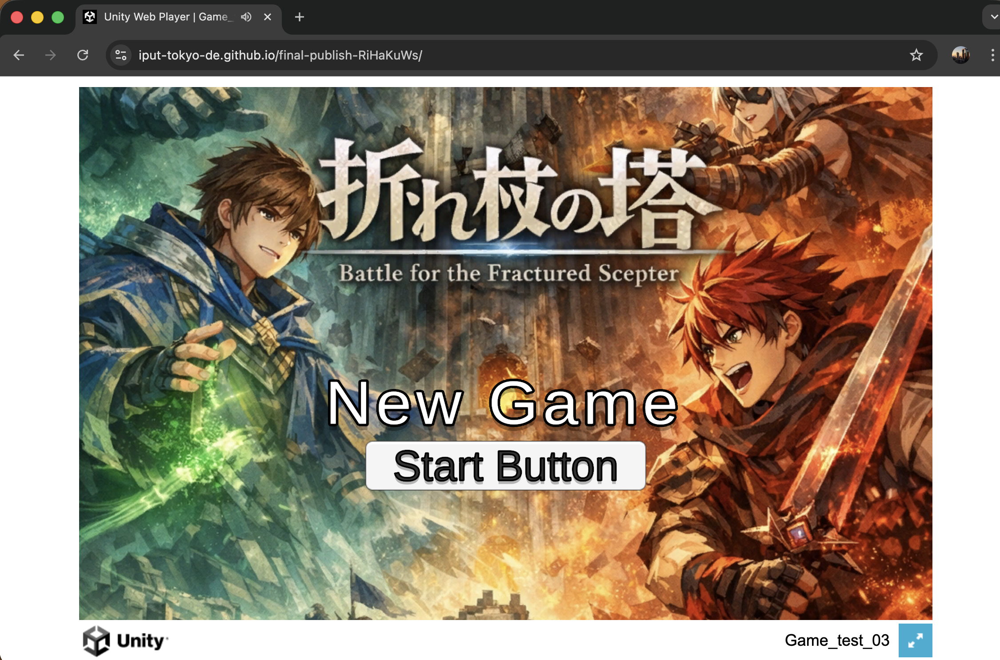

# 折れ杖の塔（Battle for the Fractured Scepter）

## ゲームの内容
ファンタジー異世界 「インタラクション」 の中心には、
天を突く巨塔 「タワー」 がそびえ立っている。
塔の最上部には、伝説の禁忌アイテム 「折れ杖」 が眠ると言われる。
「折れ杖」を手にした者は、世界の“ルール”――
力関係、因果、勝敗、正義、不利有利――を反転させ、
どんな状況でも逆転できると伝承されている。
この伝説に目をつけたのが、互いに敵視する二つの陣営。
	• 「ワナビー」：偉大なる者を支え、秩序を積み上げれば自分も強くなれると信じる集団
	• 「オレだー」：自分こそが強者であるべきと信じ、破壊と速度で上へ登る集団
先知 「スラカー」 は、「折れ杖が再び現れる」と預言した。
両陣営は預言の真偽を確かめ、そして何より“先に奪う”ため、先遣隊をタワーへ派遣する。
あなたは先遣隊の一員。タワー周辺に到達した瞬間、敵陣営の先遣隊も現れる。
一瞬の遅れが、世界のルールそのものを敵に渡すことになる。
こうして「折れ杖」を巡る争奪戦が始まる。

## 操作説明
移動　WASDキー
カメラコントロール　マウス回転
ジャンプ　Spaceキー
アクション　左クリック
